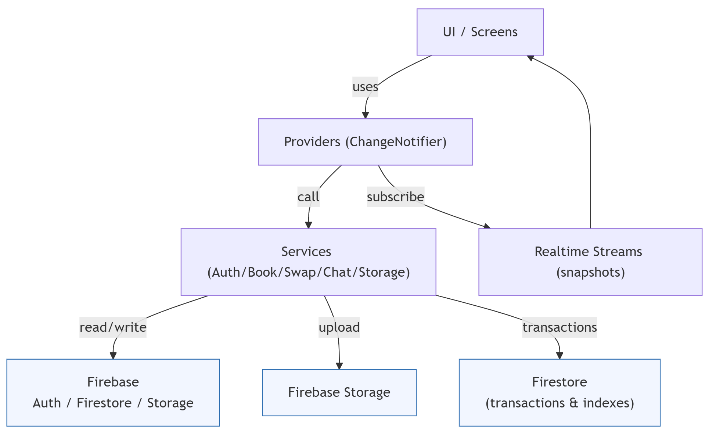

# book_swap

A Flutter app for swapping books. This README documents how to build and run the project locally (Windows PowerShell), and includes the Firebase setup steps used by the project.

## Prerequisites

- Flutter (stable). Recommended version: 3.27.x or later.
- Dart (bundled with Flutter).
- Android SDK (via Android Studio) and an Android device or emulator.
- Java JDK (11+ recommended) if using Android tools.
- Node + npm (for Firebase CLI) — optional but recommended for `firebase` and `flutterfire` tooling.

On Windows, open PowerShell (run as Administrator for SDK installs where needed).

## Quick environment checks

Run these in PowerShell to validate basic tools:

```powershell
# Flutter
flutter --version

# Dart (bundled)
dart --version

# Android SDK location (if installed via Android Studio)
$env:ANDROID_HOME

# Node (for Firebase CLI)
node --version
npm --version
```

If any command fails, install the missing tool (see Flutter docs and Android Studio installer).

## Project setup (one-time)

1. Clone the repository (already in workspace in your environment):

```powershell
git clone <repo-url> book_swap
cd "c:\Users\icyez\OneDrive\Desktop\New folder (2)\book_swap"
```

2. Install Flutter dependencies:

```powershell
flutter pub get
```

3. (Optional) Activate FlutterFire CLI if you plan to run `flutterfire configure` locally:

```powershell
dart pub global activate flutterfire_cli
# Ensure Dart pub global bin is on PATH for current session (adjust username):
$env:Path += ";${env:USERPROFILE}\\AppData\\Local\\Pub\\Cache\\bin"
```

4. (Optional) Install Firebase CLI (useful for emulators, functions, deploy):

```powershell
# Requires Node/npm
npm install -g firebase-tools
```

## Firebase setup (required for full functionality)

This project expects a Firebase project and `firebase_options.dart` generated by FlutterFire CLI. You can either use the project's existing configuration (if provided) or run the steps below.

1. Create a Firebase project in the Firebase Console: https://console.firebase.google.com/

2. Enable the following products in the Firebase Console for your project:

   - Authentication → Sign-in method → Email/Password
   - Firestore Database → create database in production or test mode (follow security rules guidance below)
   - Storage → create default bucket

3. Configure security rules (basic example; adjust for production):

Firestore rules (example):

```javascript
rules_version = '2';
service cloud.firestore {
	match /databases/{database}/documents {
		match /books/{bookId} {
			allow read: if request.auth != null;
			allow create: if request.auth != null;
			allow update, delete: if request.auth != null && request.auth.uid == resource.data.ownerId;
		}
		match /users/{userId} {
			allow read: if request.auth != null;
			allow write: if request.auth != null && request.auth.uid == userId;
		}
		match /swapOffers/{offerId} {
			allow read: if request.auth != null && (request.auth.uid == resource.data.requesterId || request.auth.uid == resource.data.ownerId);
			allow create: if request.auth != null;
			allow update: if request.auth != null && request.auth.uid == resource.data.ownerId;
		}
		match /chats/{chatId} {
			allow read: if request.auth != null && request.auth.uid in resource.data.participantIds;
			allow create: if request.auth != null;
			match /messages/{messageId} {
				allow read: if request.auth != null && request.auth.uid in get(/databases/$(database)/documents/chats/$(chatId)).data.participantIds;
				allow create: if request.auth != null;
			}
		}
	}
}
```

Storage rules (example):

```javascript
rules_version = '2';
service firebase.storage {
	match /b/{bucket}/o {
		match /books/{bookId}/{fileName} {
			allow read: if request.auth != null;
			allow write: if request.auth != null && request.resource.size < 5 * 1024 * 1024 && request.resource.contentType.matches('image/.*');
		}
	}
}
```

4. Generate `firebase_options.dart` for your project (recommended):

```powershell
# In project root
flutterfire configure

# Follow prompts to select the Firebase project and platforms
```

The command will create `lib/firebase_options.dart` which the app reads during initialization.

> If you cannot run `flutterfire configure`, you can manually add Firebase config but using the CLI is strongly recommended.

## Build & Run (development)

1. Ensure an Android device/emulator is running.

To launch an Android emulator from Android Studio or use this PowerShell command (if `emulator` is on PATH):

```powershell
# list AVDs
emulator -list-avds

# start named emulator (replace name below)
emulator -avd Pixel_4_API_30
```

2. Run the app:

```powershell
# From project root
flutter pub get
flutter run -d emulator-5554
```

Replace `-d` argument with your device id (use `flutter devices` to list).

## Common troubleshooting

- "ServicesBinding.defaultBinaryMessenger was accessed before the binding was initialized":

  - Fix: Ensure `WidgetsFlutterBinding.ensureInitialized();` is called at top of `main()` before `Firebase.initializeApp()`.

- Firestore permission denied errors:

  - Check Firestore rules and make sure Authentication is enabled and the user is signed in when reading/writing.

- Missing composite index error:

  - When Firestore says an index is required, click the URL in the error log or create the index in Firestore Console → Indexes.

- Dart/Flutter SDK version errors when running `flutter pub get`:

  - Upgrade Flutter: `flutter upgrade`.

- `flutterfire` command not recognized:
  - Ensure `dart pub global activate flutterfire_cli` was run and add `${env:USERPROFILE}\AppData\Local\Pub\Cache\bin` to PATH for PowerShell session.

## Useful commands (PowerShell)

```powershell
# Get devices
flutter devices

# Run on a specific device
flutter run -d <deviceId>

# Build APK
flutter build apk --release

# Build app bundle
flutter build appbundle

# Run unit/widget tests
flutter test

# Format code
flutter format .

# Run pub get
flutter pub get
```

## Notes

- The app relies on `lib/firebase_options.dart` to initialize Firebase. If you check this repo into a public place, avoid committing credentials for production projects.
- If using emulators (Firestore/Auth/Storage), adjust the app startup to point to local emulator endpoints.

---

If you want, I can commit a `scripts/` folder with convenience PowerShell scripts to automate common tasks (start emulator, run app, run flutterfire configure). Would you like that?

## Architecture Diagram

### Mermaid



### ASCII diagram

```
UI (Screens)
	├─> Providers (AuthProvider, BookProvider, SwapProvider, ChatProvider)
	│     └─ subscribes to Streams, exposes state to UI
	└─> Widgets (BookListingCard, Forms, etc.)

Providers
	└─> Services
				├─ AuthService  -> Firebase Auth
				├─ BookService  -> Firestore (books collection)
				├─ SwapService  -> Firestore (swapOffers collection)
				├─ ChatService  -> Firestore (chats/messages subcollection)
				└─ StorageService -> Firebase Storage (uploads/downloads)

Firebase
	├─ Auth
	├─ Firestore (collections, indexes, transactions)
	└─ Storage (book images, profile pictures)
```

### Explanation / Flow

- UI screens call `Provider.of<SomeProvider>(context)` to read state and dispatch actions (e.g., `bookProvider.createBook(...)`).
- Providers encapsulate local state and subscribe to Firestore streams exposed by Services for real-time updates.
- Services contain the direct Firebase logic (converting models to/from maps, running transactions, uploading images). This separation keeps Firebase logic out of the UI and makes unit testing easier.
- Firestore is used for primary app data (books, swap offers, chats). Storage holds images and large binary assets. Auth handles user identity.
